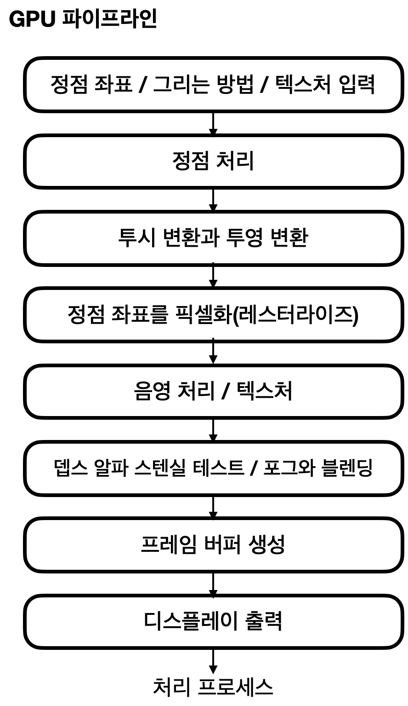
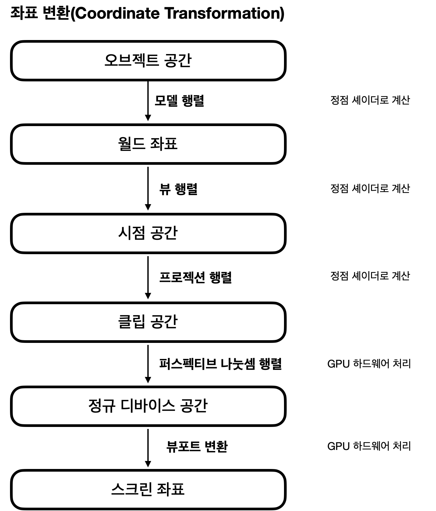

# GPU 최적화
어서 와! GPU최적화는 처음이지? 도서를 요약

## GPU Pipeline
 

1. 정점 좌표 / 그리는 방법 / 텍스처 입력
    - 기하를 표현하는 정점 데이터와 재질 표현에 쓰이는 텍스처 그리고 어떻게 입력 데이터를 가공해 출력하는지를 나타내는 GPU 설정이 필요(GPU 설정에 셰이더 프로그램도 포함)
        - 정점 데이터
        - 텍스처
        - GPU 설정
    - 게임 엔진을 사용할 경우 GPU 설정이 기본값으로 설정되어 있음. GPU 파이프라인 처리에 쓸데없는 설정이 들어 있으면 생각지도 않은 곳에서 불필요한 시간이 낭비됨 
    - 최적화의 설정 & 조절 대상
        - 추상도가 높은 게임엔진을 사용할 경우 : 모델링 데이터와 머티리얼 정보가 중심
        - 추상도가 낮은 드라이버나 언어 프로그래밍 : 명령과 버퍼 등의 어드레스 제어가 중심

### 좌표 변환
오브젝트가 있는 공간의 좌표에서 월드 공간, 뷰 공간, 스크린 공간으로 변환. 좌표와 변환 행렬을 사용 

  

 - 장면에 적합한 클립 설정을 하면 불필요한 정점을 비활성화
 - [디더링 설정](https://ko.wikipedia.org/wiki/%EB%94%94%EB%8D%94%EB%A7%81) : 필요한 픽셀이 아닌 데이터를 무효화
    - 디더링 설정 : 제한된 색을 이용하여 음영이나 색을 나타내는 것
- 클리핑(clipping) 설정 : 카메라로부터의 거리에 따라 렌더링 여부를 설정
    - Near와 Far를 비교하여 Far가 너무 크지 않은지를 확인. Far가 크면 Z 버퍼의 정밀도가 낭비되어 Z 파이팅이 일어남
    - Unity를 보면 카메라 컴포넌트 속성에 Clipping Planes라는 속성이 존재. 카메라로부터 거리가 Near보다 가까이 있고, Far 보다 멀리 있는 오브젝트는 렌더링 하지 않는 옵션
        - [Unity Clipping & Occlusion](https://daekyoulibrary.tistory.com/entry/Unity-%EA%B7%B8%EB%9E%98%ED%94%BD-%EC%B5%9C%EC%A0%81%ED%99%94%EB%A5%BC-%ED%95%98%EB%8A%94-%EB%B0%A9%EB%B2%95%EB%93%A4Low-Polygon-Clipping-Planes-Occlusion-Culling)
    - Z 파이팅 : Z 버퍼의 정밀도가 떨어지는 경우 이미지가 깜빡거리는 현상

### 정점 처리
정점 셰이더를 사용해 정점을 움직이거나 정점 단위로 광원을 계산

필요한 데이터를 셰이더 이므로 기본적으로는 지정된 텍스처와 셰이더 프로그램에 따라 여러가지 처리가 가능

### 레스터라이즈
- 레스터라이즈 : 화면 안에 들어가는 오브젝트의 픽셀을 만드는 유닛
- 레스터 라이즈의 담당은 엄밀하게는 보간하는 부분, 일련의 정점 처리를 통틀어 가리키는 경우도 존재
- 레스터라이즈의 보간은 선형보간이 좋음
- [테셀레이션](#테셀레이션tesellation)이 들어가면 삼각형 분할 방법이 달라짐. 기본적으론 삼각형 안을 보간하는 것이 단순
-  

## Reference
### 테셀레이션(Tesellation)
일정한 형태의 도형들로 평면을 빈틈 없이 채우는 것. 물체의 입체감을 확연하게 높여주는 기술 