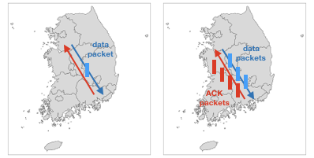
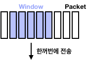
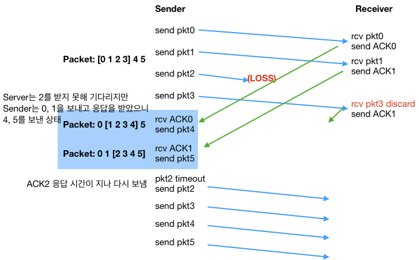

# Network Transport Layer
Server로 Packet을 보낼때 하나씩 보내고 받는 것이 아닌 여러개를 동시에 보내고 여러 개를 받음 
 
일반적으로 사용하는 Protocol로 **go-Back-N**과 **selective repeat**이 있다

## Go-Back-N(GBN)
Packet들을 Window라고 하는 단위로 묶어 Window Size 만큼 보내는 Protocol 
 
각각의 Packet은 Timer가 존재 
 
Packet 유실시 Window Size인 N개 만큼 다시 보내줘야 함

## Selective Repeat
GBN과 달리 유실된 Packet이 있더라도 그 뒤에 들어온 Packet들을 받아서 저장하고 유실된 Packet을 기다림. 받은 Packet에 대해서는 ACK를 전달
Go Back N 처럼 Window 전체를 다시 재전송해야할 필요없이 유실된 Packet만 전송하면 됨

## Selective Repeat dilemma
Packet의 Sequence Number는 계속 증가시킬수 없다(Header Size가 늘어나서 OverHead가 커짐) 몇몇 Packet은 중복된 Sequence Number를 가질수 밖에 없는데  Receiver가 Sequence Number가 중복된 Packet에 대해서는 구별을 할 수 없음   But, Sequence Number와 Window Size를 잘 조절하면 중복을 회피할 수 있음