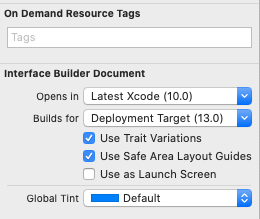
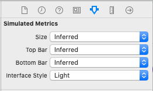
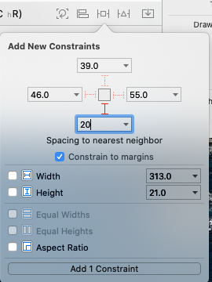
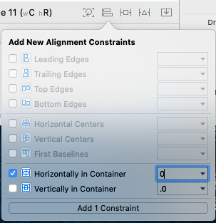
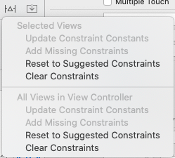
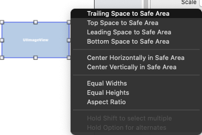
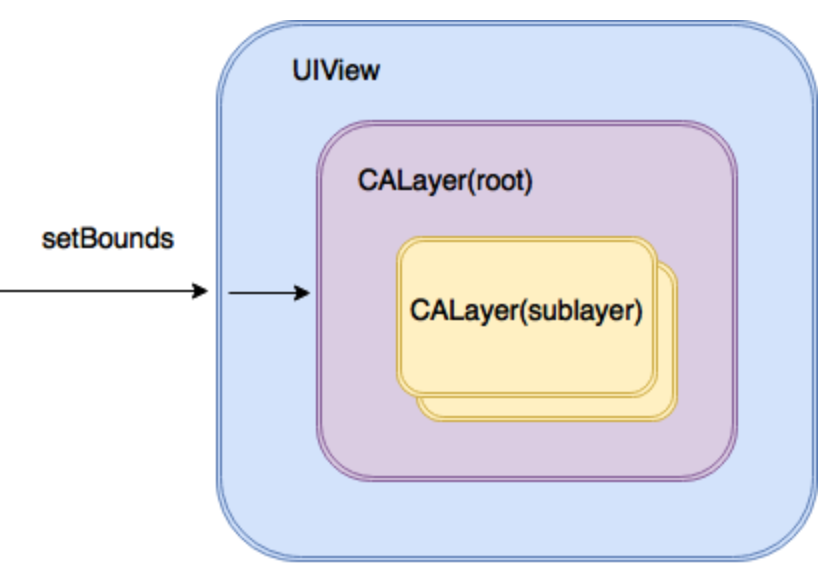

# iOS

## 뷰, 윈도우, 그리고 뷰 계층 이해하기
View: 시각적 객체, UIKit 클래스 계층의 일부인 UIView 클래스의 하위 클래스 
- UIKit
  - UIView

### UIWindow 클래스
UIWindow 클래스는 iOS 기반 애플리케이션에서 뷰 컴포넌트가 표시되는 영역을 제공.
iOS는 오직 하나의 윈도우만 가질수 있고 반드시 화면 전체를 차지한다.  
사용자는 UIWindow 객체를 직접보거나 상호작용 할 수 없음 
- UIWindow
  - UIView
    - UIButton
    - UILabel
    - UITextField
    - ....

superview는 subview의 위치 및 크기를 바꿀수 있음

## 자동 레이아웃
자동 레이아웃의 동작은 사용자 인터페이스 화면을 구성하는 뷰들에 Constraint 생성으로 구현 
자동 레이아웃 Constraint는 기본적으로 상호 의존적이어 하나의 뷰에 있는 Constraint는 관련된 다른 뷰의 Constraint와 충돌하는 상황이 발생할 수 있음. 이런 경우 시스템이 레이아웃 문제를 해결하기 위해 어떤 Constraint가 더 강한지 아니면 더 약한지를 결정해야 함. 이것은 Constraint에 우선순위를 할당하면 해결됨 우선순위는 0~100까지의 범위로 할당 "필수적 Constraint"는 1000으로 표시 "선택적 Constraint"는 그보다 작은 숫자로 표시됨.
### 고유한 컨텐츠 사이즈
몇몇 뷰들은 고유한 콘텐츠 사이즈(intrinsic content size)라는 것을 가지고 있음. 이것은 뷰 자신이 사용자에게 콘텐츠를 표시할 때 필요하다고 생각하는 크기. 
고유한 컨텐츠 사이즈를 가지면 자동 레이아웃은 그 뷰가 가진 고유한 컨텐츠 사이즈 설정에 대한 각 범위의 두 가지 Constraint를 자동으로 할당 
1. Content hugging : 뷰의 크기가 컨텐츠의 크기보다 더 커지지 않도록 함
2. Compression resistance : 뷰의 크기가 콘텐츠보다 더 작아지지 않도록 함

## 인터페이스빌더에서 자동레이아웃 Constraint로 작업하기
Xcode Storyboard의 Inspector 패널에 보면 아래와 같은 속성이 있음. 
 
Use Trait Variations는 하나의 스토리 보드 파일 내에서 여러가지 다양한 종류의 디바이스 화면 크기에 맞도록 서로 다른 AutoLayout 설정을 구성할 수 있도록 해줌.  
Xcode Storyboard의 Inspector 패널에 보면 Simulated Metrics 카테고리가 존재하는데 해당 카테고리에서는 iOS 화면을 여러가지로 바꿔볼 수 있는 기능을 제공함 
  
Xcode는 레이아웃에 Constraint를 추가하는 다양한 방법을 제공함. 가장 간단한 방법으로는 자동 레이아웃 툴바를 이용하는것으로 Pin메뉴를 클릭해서 Constraint를 설정하는 것 
 
Spacing to nearest neighbor부분을 보면 'I'표시가 점선이고 흐릿하다는 것은 Constraint가 설정되지 않았다는 것을 의미함. 값은 해당 방향에 가장 가까이 있는 이웃 객체와의 간격을 나타낸다. 가장 가까이 있는 이웃은 현재 선택된 뷰의 해당 방향에 있는 가장 가까운 뷰이거나 해당 방향의 슈퍼뷰 면이 됨 
흐릿한 'I'표시를 선택하여 빨간색 실선이 나타나게 한후 Add x Constraint 버튼을 클릭하여 뷰에 Constraint를 추가  

뷰의 수평 위치를 지정해주는 방법으로는 Align 메뉴를 이용하는 것 
 
Horizontally in Container 옆에 있는 체크박스를 활성화한 후 중앙에서의 오프셋(offset) 값을 설정한 후 Add x Constraint를 클릭한다.

## 인터페이스 빌더의 자동 레이아웃 기능들
### 추천 컨스트레인트
객체가 레이아웃 캔버스에 추가되어도 인터페이스 빌더는 개발자가 필요한 Constraint를 추가하도록 디폴트 컨스트레인트를 구현하지 않음. But 인터페이스 빌더가 추천 Constraint를 적용하도록 하는 옵션이 존재. 
레이아웃에 누락된 Constraint로 인해 경고가 생긴 경우, 인터페이스 빌더가 누락되었다고 믿는 Constraint들을 자동으로 추가하는 옵션도 제공 
이러한 기능을 제공하는 옵션들은 Resolve Auto Layout Issues 메뉴를 통해 접근이 가능 
 
대부분의 추천 Constraint는 자동 레이아웃을 구현하는 최고의 시작점이 됨 
==> **사용자 인터페이스 설계하는 일반적인 절차는 뷰들을 Drag @ Drop 하여 배치시키고 추천 Constraint를 적용한 다음, 완벽한 레이아웃을 위해서 Constraint를 알맞게 편집하고 조절하는 것**
 

## 인터페이스 빌더에서 새로운 Constraint 생성하기
Constraint를 생성하는 가장 쉬운 방법은 툴바의 옵션들을 이용 
또 다른 방법으로는 뷰를 Ctrl+클릭한 상태로 드래그하여 뷰 영역 밖에서 누르고 있던 마우스 버튼을 놓는 것, 이렇게 하면 Constraint 옵션들을 보여주는 메뉴가 나타남. 메뉴 옵션은 드래그한 선의 방향에 따라 달라짐.  
캔버스에 있는 다른 뷰로 드래그하면 두 개의 뷰 간의 간격이나 정렬, 또는 동등한 크기 Constraint를 설정하는 옵션들이 나옴

## 종횡비 Constraint 추가하기
뷰의 높이와 폭은 뷰에서 Ctrl+클릭한 상태로 **대각선 방향**으로 드래그하고 마우스 버튼을 놓으면 종횡비(Aspect Ratio)를 유지하는 Constraint를 만들 수 있음 
 

## 자동 레이아웃 문제 해결하기
누락된 Constraint를 자동으로 추가한다거나 추천 Constraint로 다시 설정하는것과 같은 작업을 수행하기 위해 Resolve Auto Layout Issue메뉴에 있는 옵션들을 이용해 해결할 수 있음

## CALayer
UIView에 속하며 UIView를 지원해주는 역할을 함. 각 뷰마다 루트 layer는 하나씩 존재하고 이 루트 layer는 각각 SubLayer들을 가짐. 
뷰 위에 컨텐츠와 애니메이션을 그리는 행위는 CALayer가 담당하게 됨 
UIView는 CALayer를 감싸고 있음. 그렇기 때문에 UIView의 bounds가 변경되면 UIView는 자신의 루트 layer의 bounds를 변경함 But, SubLayer들은 자동으로 맞춰지지 않음 
 
