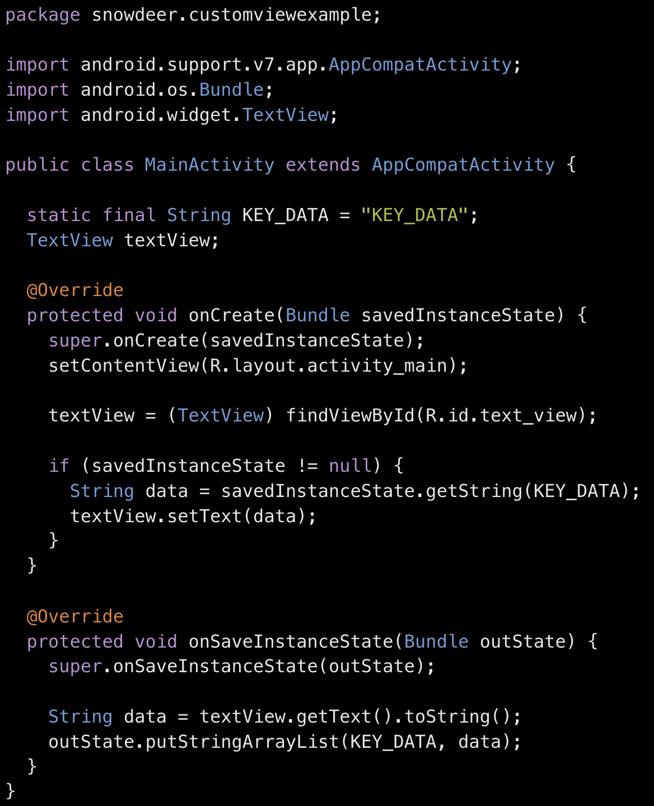

# Android Question

### 안드로이드 4대 컴포넌트
- **액티비티** : 안드로이드에서 화면을 관리하고 사용자가 발생시키는 다양한 이벤트를 처리하는 컴포넌트
- **서비스** : 화면에서는 보이지 않지만 백그라운드에서 특정 기능을 수행하는 컴포넌트, 단 메인 스레드에서 작동하기 때문에 앱이 터지는 걸 방지하기 위해 별도의 thread가 필요
- **컨텐트 프로바이더** : 앱 간 데이터 공유를 위해 클래스를 제공하는 컴포넌트
- **브로드캐스트 리시버** : 특정 어플에서 발생하는 특정 브로드캐스트 메시지를 처리하는 컴포넌트

### Activity Life Cycle
Activity가 시작하는 순간부터 종료되는 순간까지의 주기를 말함
- **onCreate()**: 액티비티가 시작될 때 레이아웃을 구성하면서 한 번 실행
- **onStart()**: 액티비티가 사용자에게 보이기 직전에 실행. BroadcastReceiver 실행
- **onResume()**: 사용자가 액티비티와 상호작용하는 기능을 넣은 곳, 무조건 실행되어야 하는 기능이 들어감
- **onPause**: 포커스를 잃어 화면이 부분적으로 보이지만 곧 사라질 때 실행
- **onStop()**: 사용자에게서 화면이 완전히 사라지고 다른 액티비티가 보여질 때 호출
- **onDestroy()**: 화면이 완전히 종료되기 직전에 호출

### Fragment Life Cycle
- **onAttach**
- **onCreate**
- **onCreateView**
- **onPause**
- **onStop**
- **onDestroyView**

### ListView와 RecyclerView의 차이
- 리스트뷰와 리사이클러뷰는 모두 스크롤 가능한 리스트 형식의 레이아웃을 구현할 때 사용.
- 리스트뷰는 스크롤할 때 나오는 아이템을 끊임없이 새로 만들어 메모리 성능에 부담이 갈 수 있는 반면 리사이클뷰는 처음 만들어지는 아이템의 개수는 정해져있고 뷰홀더를 통해 들어가는 뷰의 재사용을 가능하게 함

### Activity가 가로/세로로 전환되거나 메모리 부족 등으로 종료되었을 때 데이터를 유지하는 방법
- onSaveInstanceState()의 Bundle에 저장되어야 할 상태 데이터를 저장하여 유지

#### onSaveInstanceState()
- Activity가 종료되는 경우
    - 사용자가 '뒤로 가기(Back)' 버튼을 눌러 Activity를 종료한 경우
    - Activity가 백그라운드에 있을 때 시스템 메모리가 부족해진 경우
    - 언어 설정을 변경할 때
    - 화면을 가로/세로 회전할 때
    - 폰트 크기나 폰트를 변경 했을 때

### Process와 Thread의 차이
Process는 운영체제로부터 필요한 메모리를 할당받아 실행되는 프로그램의 단위, Thread는 Process내에서 실행되는 흐름의 단위 

### Thread와 Handler
