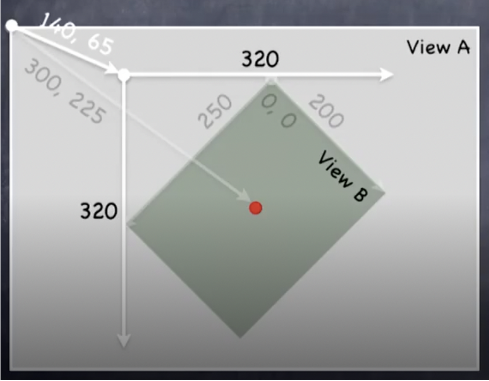
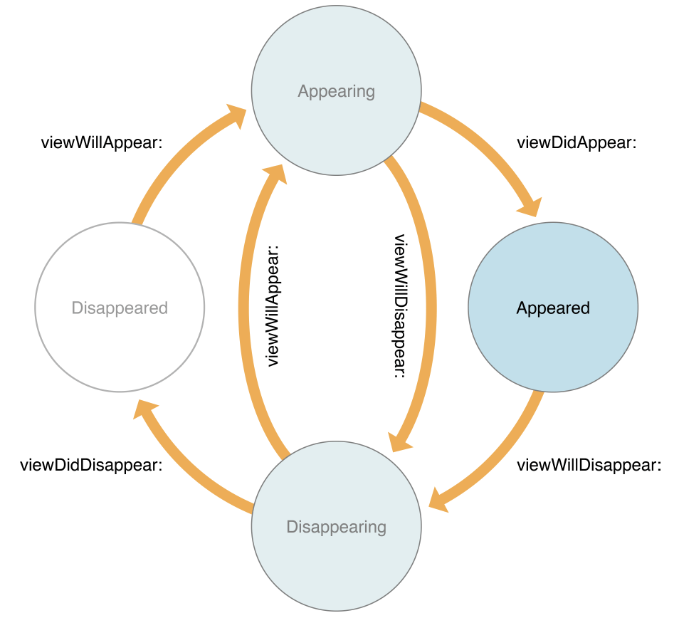
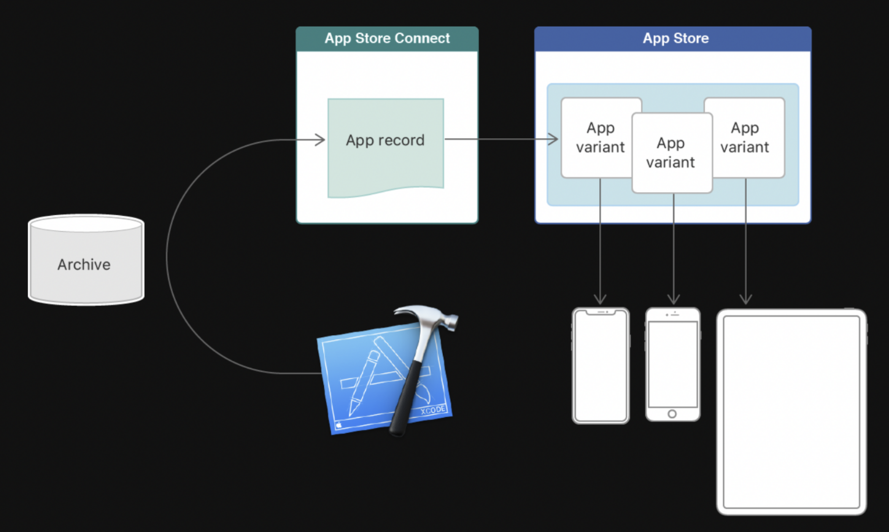
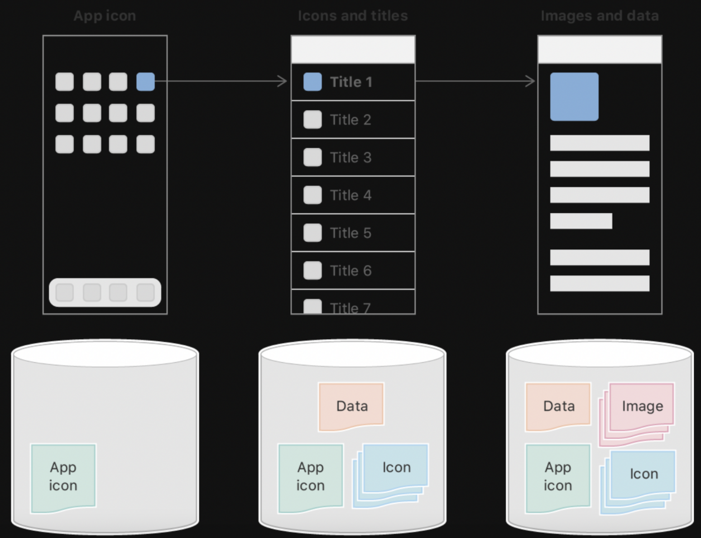
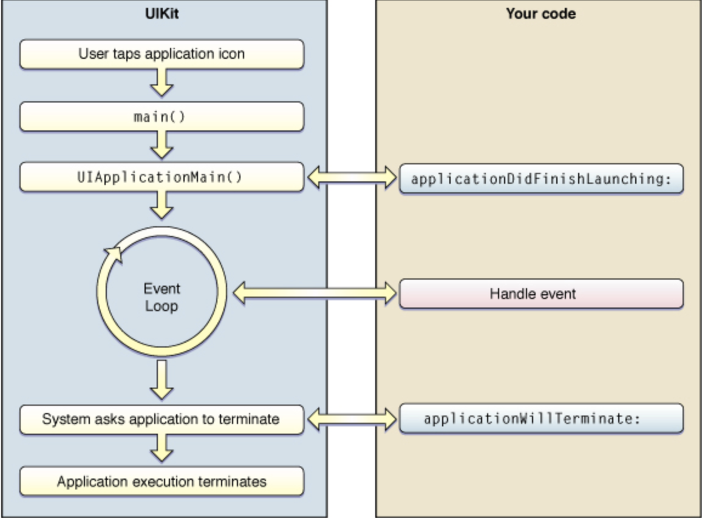
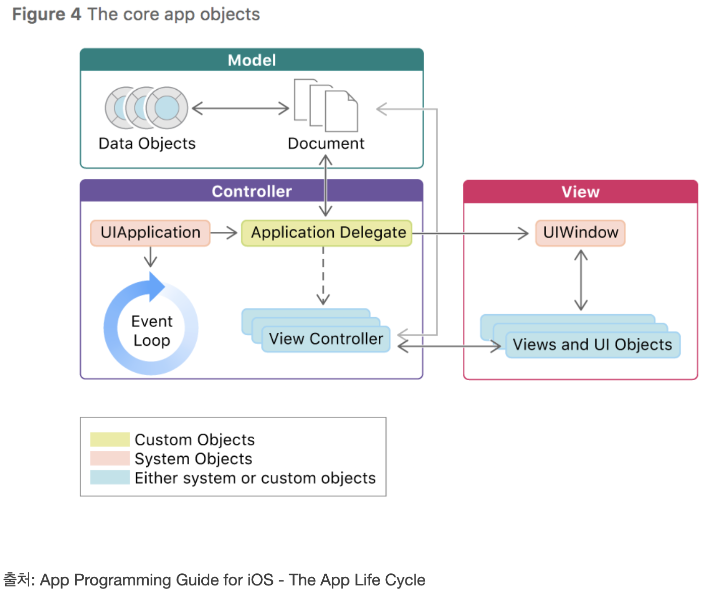
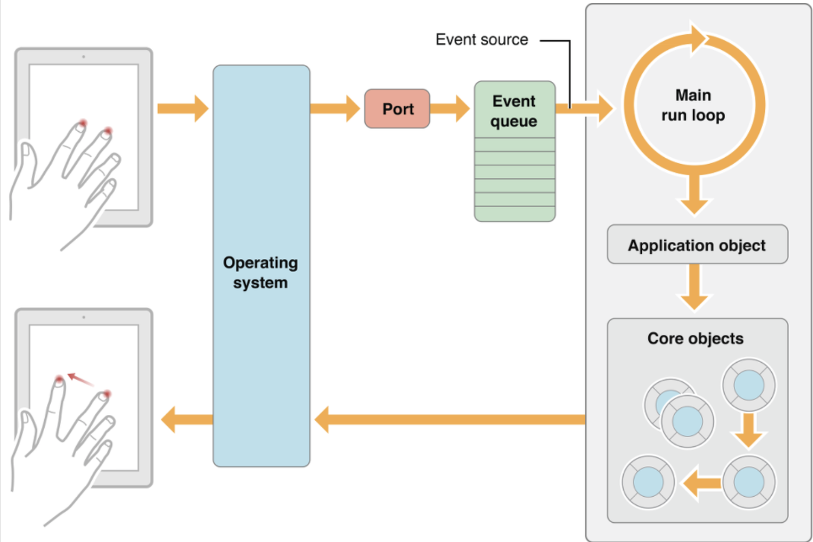
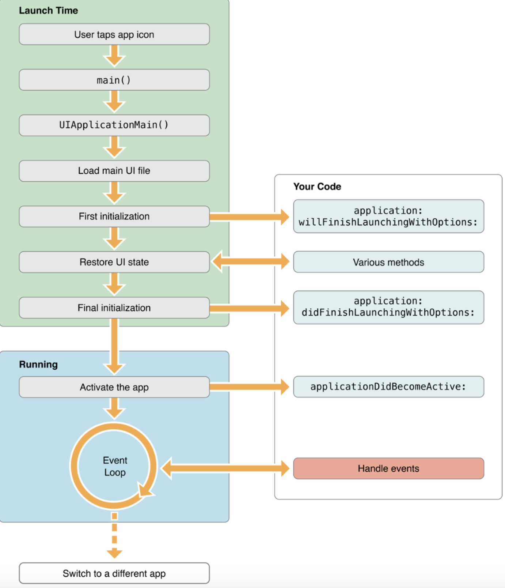
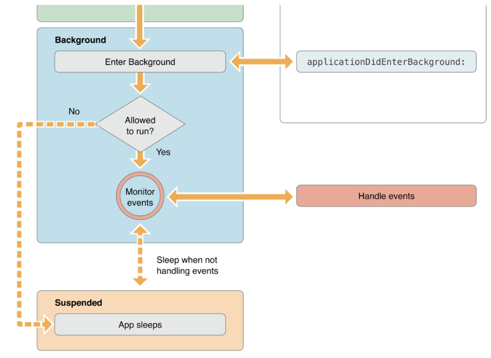

# iOS Question

### 1. Bounds vs Frame의 차이점
- Frame : The frame rectangle, which describes the view's location and size its **superview's coordinate system**
- Bounds: The bounds rectangle, which describes the view's location and size in its **own coordinate system**

두 개념 모두 뷰의 위치와 사이즈를 반환하는 CGRect 타입 변수

- Create a View
```
let rect = CGRect(x: 10, y: 10, width: 100, height:100)
let myView = UIView(frame: rect)
```

뷰를 생성하기 위해선 크기와 좌표가 필요하며 이러한 좌표와 크기는 CGRect이라는 형태로 표현
- CGRect: A structure that contains the location and dimensions of a rectangle.

CGRect은 뷰의 크기와 좌표계를 담는 구조체. CG는 CoreGraphics의 약자. 화면 표현에 대한 자료들은 모두 CG로 시작하는 자료형을 사용

iOS의 좌표계 시스템은 뷰의 좌측 상담이 원점. y 값이 증가하면 아래로 이동하고 x값이 증가하게 되면 우측으로 이동하게 됨


<br>
Frame : Point(140, 65) Size(320, 320)
Bounds: Point(0, 0) Size(200, 250)

<br>

### 2. 실제 디바이스가 없을 경우 개발 환경에서 할 수 있는 것과 없는 것을 설명
시뮬레이션(Simulation) vs 에뮬레이션(Emulation)
- Simulation: 실제 시스템과 동일하지 않지만 원하는 시스템의 동작을 흉내내어 같은 동작을 하는 것
- Emulation: 실제 시스템과 완전히 동일한 방법으로 원하는 시스템의 HW 동작마저 흉내내는 것

Xcode의 경우 시뮬레이터 기능을 지원. 시뮬레이터는 실제 디바이스의 출력 결과만 흉내내기에 같은 기능에 대해 실제 디바이스와 시뮬레이터가 서로 다른 결과를 보여주거나 지원되지 않는 기능들이 존재

- 시뮬레이터만으로 할 수 없는 것
    - 시뮬레이터를 사용하면 실제 디바이스 환경이 아닌 Mac 환경에서 실행되는 것이기 때문에 CPU, Memory, Network 연결 등이 컴퓨터의 리소스에 엑세스되어 실제 디바이스에서 발견되는 리소스보다 더 빠를 수 있음
    - 주변 조도 센서, 기압계, 가속계 및 자이로스코스 센서 등을 사용할 수 없음. 블루투스, 카메라, 전화 기능도 사용할 수 없음

<br>

### 3. 앱의 콘텐츠나 데이터 자체를 저장/보관하는 특별한 객체를 무엇이라고 하는가?
- **UserDefaults**
    - 키-값 쌍으로 저장하는 인터페이스
    - 런타임시 개체를 이용해 기본 데이터베이스에서 사용하는 기본값을 읽어오기에 값이 필요할 때마다 DB를 열 필요가 없음
    - 대용량의 데이터보단 자동로그인 여부, 아이디, 환경설정에서의 설정 데이터 값과 같은 단일 데이터 등을 보관

- **CoreData**
    - 객체 그래프를 관리하기 위한 Framework
    - SQLite와 같이 테이블을 이용하지 않고 객체를 생성하여 데이터를 운영하여 더 많은 저장공간과 메모리를 필요로 하지만 더욱 빠르게 데이터를 가져옴
    - DataModel을 생성한 후 Entity를 생성

- SQLite
    - Swift에는 특별한 설치없이 바로 사용 가능
    - 전체 데이터베이스를 디스크 파일 1개에 저장
    - 수많은 프로세스와 스레드의 접근으로부터 안전

- Realm
    - SQLite와 같이 오픈소스이며 모바일에 최적화된 라이브러리. 
    - SQLite, Core Data보다 속도가 빠르고 성능면에서 더 우수
    - 대용량의 데이터에 대해 무료로 사용이 가능하며 용량이 적고 큼에 상관없이 속도와 성능이 유지


### 4. 앱 화면의 콘텐츠를 표시하는 로직과 관리를 담당하는 객체를 무엇이라고 하는가
- UIViewController : An object that manages a view hierarchy for your UIKit app
    - UIKit으로 제작된 앱의 뷰계층구조를 관리하는 객체.
    - 화면 위에 보여지게 될 UIView들의 로직과 관리를 담당

- UIView : An object that manages the content for a rectangular area on the screen
    - 화면 위의 콘텐츠를 관리하기 위한 사각형 영역 객체.

- UIViewController의 대표적인 일
    - 뷰의 컨텐츠 업데이트, 주로 기본 데이터의 변경에 반응
    - 뷰와 사용자간의 상호작용에 반응
    - 전반적인 인터페이스 레이아웃 관리 및 뷰의 사이즈 조정
    - 다른 컨트롤러와의 화면 전환



- UIViewController의 유형
    1. ContentViewController
        - 가장 기본적인 뷰 컨트롤러. 하나의 화면을 담당
    2. ContainerViewController
        - 하나 이상의 뷰 컨트롤러를 관리하는 뷰 컨트롤러. 하나 이상의 컨트롤러의 레이아웃, 화면 전환을 담당
        - Ex] UINavigationController, UITabBarController, UISplitViewController

### 5. App thinning에 대해서 설명하시오
어플리케이션이 디바이스에 설치될 때 앱스토어와 운영체제가 디바이스의 특성에 맞게 설치되도록 하는 설치 최적화 기술. <br>
최소한의 디스크 사용과 빠른 다운로드를 제공
- 구성
    - 슬라이싱(slicing)
    - 비트코드(bitcode)
    - 주문형 리소스(on-demand resource)

- 슬라이싱(Slicing)

<br>

    - 다양한 기기와 운영체제 버전에 대하여 여러 가지 app bundle의 변형(variants)를 생성하고 전달하는 과정
        - 변형(variants)은 실행가능한 **아키텍처**, **리소스**만 포함

    - 앱을 App Store Connect에 업로드하게 되면 앱스토어는 **앱이 지원하는 기기** 및 **운영체제 버전**에 따라 다양한 변형(variants)를 생성하고 제공
    - 사용자가 앱 스토어를 통해 앱을 설치하게 되면 사용자의 기기 및 기기의 운영체제 버전에 맞춰 변형(variants)이 다운로드가 됨 

- 비트코드(Bit Code)
    - 컴파일된 프로그램의 중간표현(Intermediate Representation)
        - 중간표현 이란 기계언어로 번역되기 이전 단계
    - 비트코드를 사용하여 업로드 하면 Apple이 애플리케이션을 재컴파일하여 앱 바이너리(app binary)를 생성. 
    - 비트코드를 사용하지 않으면 모든 경우의 디바이스 경우에 따라 바이너리로 생성하여 합쳐져 fat binary가 업로드 되지만 비트코드를 사용하면 필요 경우에 따라 재컴파일하게 되어 최적화가 가능하게 됨

- 주문형 리소스(On-Demand Resource)

<br>

    - 이미지나 사운드 같은 리소스를 키워드로 태그 할 수 있고, 태그별로 그룹을 요청
        - 주문형 리소스(ODR)은 앱스토어에 IPA와 별도 저장
    - 리소스를 필요할 때 다운로드 할 수 있게 됨 
    - ios, tvos 9.0 이상부터 사용 가능 

- [App Thining Unity 참고](https://docs.unity3d.com/kr/560/Manual/AppThinning.html)

### 6. 앱이 시작할 때 main.c 에 있는 UIApplicationMain 함수에 의해서 생성되는 객체는 무엇인가?

UIApplication 객체가 생성

- App Life Cycle


<br>

- UIApplicationMain() 호출 부분의 경우 swift 이전에 obj-c로 작성되었던 앱은 c언어 기반이었기에 앱이 실행되면 OS가 가장 먼저 main.m 파일 안에 main() 함수를 호출하여 앱이 시작
- swift의 경우 UIKit 프레임워크 안에 main() 함수를 숨겨놓음. 따라서 앱이 실행되면 가장 먼저 OS가 개발자는 찾아볼 수 없는 main() 함수를 호출하고 main() 함수는 뒤이어 UIApplicationMain() 함수를 호출하여 UIApplication 객체가 생성

- UIApplication 이란?
    - The centralized point of control and coordination for apps running in iOS
    - iOS에서 실행중인 앱의 제어와 조정을 담당하는 중앙지점
    - 모든 iOS 앱은 단 하나의 UIApplication 인스턴스를 가지며 개발자가 원할시 UIApplication의 shared 프로퍼티를 통해 객체에 접근할 수 있음

### 7. @main vs @UIApplicationMain
- @main : 프로그램의 진입점을 나타내줌
- @main을 통해 어디서부터 이 앱이 최초 실행되고 시작될지를 명시해주는 키워드
- @main 키워드가 나오기 전에는 @UIApplicationMain 키워드를 사용하고 있었음

<br>

- UIKit에서의 @main
```
import UIKit

@main
class AppDelegate: UIResponder, UIApplicationDelegate {
    ...
}
```
UIKit의 라이프사이클로 앱을 만들면 AppDelegate 클래스에 @main이 붙게 됨. AppDelegate가 사실상 App Life Cycle을 관리하는 모든 주체이기에 여기에 붙음

- SwiftUI에서의 @main
```
import SwiftUI

@main
struct SwiftUIApp: App {
    ...
}
```
SwiftUI 라이프사이클을 따르는 앱을 만들면 실제 App구조체에 @main이 붙게됨

### 8. 앱이 foreground에 있을 때와 background에 있을 때 어떤 제약사항이 있나요?
- Foreground Mode : 메모리 및 기타 시스템 리소스에 높은 우선순위를 가지며 시스템은 이러한 리소스를 사용할 수 있도록 필요에 따라 backgroun 앱을 종료
- Background Mode : 가능한 적은 메모리 공간을 사용해야 함(시스템 리소스 해제, 메모리에서 해제 후 데이터를 디스크에 작성)

<br>

- not Running : 앱이 실행되지 않은 상태
- Foreground 상태
    - InActive
        - 앱이 실행중이지만 아직 아무런 이벤트를 받지 않은 상태
        - Foreground 상태에서 전화가 오거나 잠금상태 등에서 InActive 상태를 가짐
    - Active
        - 앱이 실행중이며 현재 이벤트를 받고 있고 발생한 상태
- Background 상태
    - 앱이 백그라운드에 있는 상태지만 여전히 실행되는 코드가 있는 상태
- Suspend
    - 앱이 백그라운드에 있고 실행되는 코드가 없는 상태
    - 앱은 여전히 메모리에 존재하며 Suspend 상태가 될 당시의 상태를 저장하고 있지만, CPU나 배터리를 소모하지는 않음. 언제든지 메모리 부족등의 이유로 종료 가능 

### 9. 상태 변화에 따라 다른 동작을 처리하기 위한 앱델리게이트 메서드들을 설명
iOS 13.0 이후 scenedelegate 메서드로 변경

- UIApplicationDelegate
    - 앱이 InActive 상태로 전환되기 직전에 호출 : applicationWillResignActive
    - 앱이 백그라운드 상태로 전환된 뒤 호출 : applicationDidEnterBackground
    - 앱이 Active 상태가 되기 전에 호출 : applicationWillEnterForeground
    - 앱이 Active 상태로 전환된 후 호출 : applicationDidBecomeActive
    - 앱이 종료되기 직전에 호출 : applicationWillTerminate 메서드

### 10. 앱이 In-Active 상태가 되는 시나리오
- App이 실행중이지만 이벤트를 받지 않은 상태
- 전화나 메시지 같은 interrupt발생 시
- 알림창같은 것이 화면을 덮어 앱이 실질적으로 event를 받지 못하는 상태

### 11. AppDelegate & SceneDelegate
iOS 13 이전 버전의 앱에서는 app delegate가 앱의 실행과 포그라운드, 백그라운드에 대한 로직을 처리하는 역할을 함
<br>
iOS 13 버전부터는 app delegate의 역할이 app delegate와 scene delegate로 나뉨(iPad OS의 새로운 멀티윈도우 지원 기능의 결과)

- AppDelegate
    - 어플리케이션 단계의 라이프 사이클 이벤트에 대해 처리를 담당
    - func application(_:didFinishLaunchingWithOptions:)->Bool
        - **앱이 시작되고 앱의 설정이 완료되면 호출**
    - func application(_:configurationForConnecting:options:)->UISceneConfiguration
        - **앱에 표시될 새로운 scene이나 window가 필요할 때마다 호출**
        - 앱 시작시 호출되지 않고 새로운 scene이나 새로운 window를 가져와야 하는 경우에만 호출
    - func application(_:didDiscardSceneSessions:)
        - **scene을 삭제할 때 또는 프로그래밍 방식으로 삭제될 때 호출**

- SceneDelegate
    - iOS 13 버전부터는 SceneDelegate가 AppDelegate로부터 UIWindow와 관련된 부분을 담당. 앱에는 둘 이상의 scene이 있을 수 있으며 이제 **scene은 앱의 사용자 인터페이스 및 콘텐츠의 배경으로 사용**, SceneDelegate는 UI 및 데이터를 화면에 표시하는 것을 담당
    - scene(_:willConnectTo:options:)
        - UISceneSession의 라이프 사이클에서 호출되는 첫 번째 메서드
        - **scene이 앱에 추가될 때 호출**
    - sceneDidDisconnect(_:)
        - scene이 백그라운드 상태로 전환될 때, iOS는 메모리를 회수하기 위해 scene을 삭제할 수 있음
        - 앱이 종료되거나 실행되지 않는 것이 아닌 scene만 session에서 연결 해제되고 비활성화
    - sceneDidBecomeActive(_:)
        - sceneWillEnterForeground 메서드 바로 다음에 호출 **scene이 화면에 표시되도록 준비할 때 사용**
    - sceneWillEnterForeground
        - 앱이 처음 실행될 때나 백그라운드 상태에서 포그라운드 상태로 전환될 때처럼 **scene이 시작되려고 할 때 호출**
    - sceneWillResignActive(_:)
        - 사용자가 **scene과의 상호작용을 중지할 때 호출**
    - sceneDidEnterBackground(_:)
        - scene이 화면에 표시되지 않고 **백그라운드로 진입할 때 호출**

### 12. UIApplication 객체의 컨트롤러 역할은 어디에 구현해야 하는가?
UIApplicationMain 함수

#### iOS 앱의 생명주기(App Life Cycle)와 앱의 구조(App Structure)
- 앱의 실행과정
    - main 함수가 실행
    - main 함수는 UIApplicationMain 함수를 호출
    - UIApplicationMain 함수는 앱의 본체에 해당하는 객체인 UIApplication 객체를 생성
    - nib 파일을 사용하는 경우나, info.plist 파일을 읽어들여 파일에 기록된 정보를 참고하여 그외에 필요한 데이터를 로드
    - AppDelegate 객체를 만들고 앱 객체와 연결하고 런루프를 만드는 등 실행에 필요한 준비
    - 실행 완료를 앞두고 앱 객체가 앱 델리게이트에게 application:didFinishLaunchingWithOptions: 메시지를 보낸다

<br>

- UIApplicationMain Function
    - **UIApplicationMain함수**는 코코아 터치 프레임워크에서 앱의 라이프 사이클을 시작하는 함수.
UIApplication 객체의 인스턴스를 만들고 해당 객체의 앱으로서 기능하기 위한 기반을 마련하는데 이 과정을 앱로딩 프로세스라고 부름
    - Objective-C vs Swift
        - Objective-C언어로 개발하면 main.m이 자동으로 만들어져 있는걸 볼수 있고 Swift로 시작하면 AppDelegate.swift 파일 맨 위에 @UIApplicationMain이 붙은 것을 볼수 있음
        - Swift에서는 main을 다루기 위해선 main.swift를 직접 만들어서 사용할 수 있음


- The Strcture of an App
    - 모든 iOS 앱의 중심에는 시스템과 앱의 여러 객체들간의 대화를 가능하게 해주는 UIApplication 객체가 있음 
    - iOS 앱은 기본적으로 MVC(Model-View-Controller)구조를 사용


<br>

- The Main Run Loop
    - Main Run Loop는 사용자 관련 이벤트들을 받은 순서대로 처리
    - UIApplication 객체는 앱이 실행될 때, Main Run Loop를 실행하고 이 Run Loop로 이벤트를 처리
    - Main Run Loop는 앱의 메인 스레드에서 동작


<br>

- 앱을 전면으로 실행
    - 앱이 시작되는 부분에서 시스템은 프로세스와 앱의 MainThread, 그리고 MainThread에서 main 함수를 생성
    - main함수에서 UIKit 프레임워크를 즉시 다룰 수 있고 UIKit 프레임워크는 앱의 초기화와 실행준비를 함


<br>

<br>

Reference: https://jinshine.github.io/2018/05/28/iOS/%EC%95%B1%EC%9D%98%20%EC%83%9D%EB%AA%85%EC%A3%BC%EA%B8%B0(App%20Life%20Cycle)%EC%99%80%20%EC%95%B1%EC%9D%98%20%EA%B5%AC%EC%A1%B0(App%20Structure)/

///////////////////////////////////////////////////////////////////////////////

### 13. NSOperationQueue vs GCD Queue
iOS에는 멀티스레딩을 할 수 있는 두 가지 방법이 존재
- GCD(Grand Central Dispatch) : C 기반의 low-level API
- NSOperation : Obj-C 기반으로 만들어진 high-level API

<br>

- NSOperationQueue
    - NSOperation 객체의 우선순위 및 준비 상태에 따라 대기열에 있는 객체
    - Operation Queue에 추가된 작업은 작업이 완료될 때까지 대기열에 남아 있음
    - 작업이 추가된 후에는 대기열에서 직접 제거할 수 없음
    - 모든 작업이 끝나지 않은 상태에서 Operation queue를 중지시키면 메모리 릭이 발생할 수 있음
    - GCD에서는 할 수 없는 기능들(다시시작, 취소, 일시중지)를 제공하지만 구현이 복잡하고 무거움
    - Key Value Observing(KVO)를 사용할 수 있는 프로퍼티들이 존재

- GCD(Grand Central Dispatch) Queue (Dispatch Queue)
    - 동시성 모델을 매우 간단하게 사용할 수 있는 low-level C 기반 API
    - 작업 항목을 동기 또는 비동기적으로 예약
    - 메인 큐에서 작업 항목을 동기적으로 실행하면 교착 상태가 발생할 수 있음

### 14. GCD API 동작 방식과 필요성
GCD는 Queue에 넣으면 그에 따른 스레드를 적절하게 생성해 분배해주는 방법. GCD에서 사용하는 Queue의 이름이 Dispatch Queue임. DispatchQueue에 작업이 추가되면 GCD는 작업에 맞는 스레드를 자동으로 생성해서 실행하고 작업이 종료되면 스레드를 제거.

- DispatchQueue 란?
    - 앱의 메인 스레드나 백그라운드 스레드에서 순차적으로 또는 동시에 작업을 관리하는 개체.
    - 작업 항목을 동기식 또는 비동기식으로 예약

```
DispatchQueue.global().sync{
    // task
}
```
- DispatchQueue: iOS에서 동시성 프로그래밍을 돕기 위해 제공하는 Queue
- global: DispatchQueue의 한종류
- Sync: 동기 / Async: 비동기

GCD이전 멀티스레딩을 위해 Thread와 OperationQueue 등의 클래스를 사용했는데 Thread는 임계구역(Critical Section)등을 이용한 Lock 을 관리하기가 어려웠음. 그리고 OperationQueue는 GCD에 비해 무겁고 Boilerplate 코드들이 많이 필요하게 되는 문제가 존재

- DispatchQueue
    - Queue에 전달된 작업은 시스템이 전적으로 관리하는 스레드 풀(a pool of threads)에서 실행
    - DispatchQueue는 2는 2개의 타입(Serial, Concurrent)로 구분
        - **MainQueue(Serial Queue)** : 하나의 작업이 끝나야 다음 작업을 함. 
            - 분산처리시킨 작업을 다른 한 개의 쓰레드에서 처리하는 큐
        - **Global Queue(Concurrent Queue)** : 큐에 추가된 순서대로 작업 수행. 동시에 여러 작업을 수행하므로 작업이 끝나는 순서를 알 수 없고 큐에서 몇개의 작업이 수행중인지도 알 수 없음
            - 분산처리시킨 작업을 다른 여러 개의 쓰레드에서 처리하는 큐
    - 각 작업은 동기(sync) 방식과 비동기(async) 방식으로 실행 가능하지만 Main Queue에서는 async만 사용 가능. MainQueue에서 sync 방식을 동작하면 데드락 상태에 빠지게 됨
        - **Sync** : 작업이 다 끝난 다음에만 현재의 queue에게 컨트롤을 넘김
            - 원래의 작업이 진행되고 있던 곳(메인스레드)에서 Dispatch Global Queue로 보낸 작업을 동기적으로 기다림
        - **Async** : 작업을 수행할 다른 큐에게 작업을 넘기자마자 현재의 queue에게 컨트롤을 돌려줌
            - 원래의 작업이 진행되고 있던 곳(메인스레드)에서 Dispatch Global Queue로 보낸 작업을 기다리지 않음

- async - concurrent
    - 제어권을 즉시 main thread로 돌린다 / 큐에 있는 작업이 동시에 여러개가 동작하고 있을 수 있음
- async - serial
    - 제어권을 즉시 main thread로 돌림 / 큐에 있는 작업이 단 한개만 동작하고 있음
- sync - concurrent
    - 코드는 다른 thread에서 실행되지만 main thread에서는 해당 작업이 끝나기를 기다림(UI Update 같은 것들이 블럭됨) / 큐에 있는 작업이 동시에 여러개 동작하고 있을 수 있음

- MainQueue에서 Sync 함수를 부른다면
    - mainqueu는 sync 블럭의 task가 완료될때까지 기다림. 하지만 task는 메인 스레드에서 serial하게 실행되는 mainqueue에 들어있으므로 이미 block 상태인 메인 스레드에서 작업은 영영 시작되지 않음(deadlock)

### 15. Global DispatchQueue 의 Qos 에는 어떤 종류가 있는지, 각각 어떤 의미인지 설명하시오
QoS(Quality of Service)
<br>
QoS는 중요도와 우선순위에 따라 User-interactive, User-initiaded, Utility, Background 4가지로 구분

- userInteractive
    - 중요도가 높고 즉각적인 반응이 요구되는 작업을 위해 가장 자원을 많이 쓰도록 하는 QoS
    - main thread에서 작업, UI 새로고침 또는 애니메이션 수행과 같이 사용자와 상호작용하는 작업
- userInitiated
    - 사용자가 시작한 작업이며 저장된 문서를 열거나 사용자 인터페이스에서 무언가를 클릭할 때 작업을 수행하는 것과 같은 즉각적인 결과가 필요
- default
    - userInitiated와 utility 사이
    - 사용자가 지정하지 않으면 default로 처리되며 GCD global queue는 이 level(default)에서 실행
- utility
    - 작업을 완료하는데 약간의 시간이 걸릴 수 있으며, 데이터 다운로드 또는 import와 같은 즉각적인 결과가 필요하지 않음
- background
    - 백그라운드에서 작동, indexing 동기화 및 백업과 같이 사용자가 볼 수 없는 작업 위주