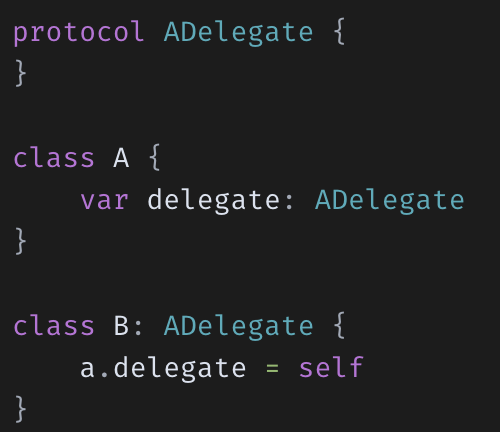

# Swift

### 1. struct와 class와 enum의 차이를 설명
- 열거형(Enum)은 저장 프로퍼티(Stored Property)를 가질 수 없음, 클래스와 구조체만 저장 프로퍼티를 가질 수 있음

- 차이점
1. 초기화 함수(Initializer)
    - Class와 Struct는 초기화함수를 갖지만 Enum은 초기화 함수를 갖지 않음. 왜냐하면 열거형(Enum)은 연관값을 구별되는 값들에 할당하기 때문
2. 상속(Inheritance)
    - Class에서는 상속이 가능하지만 Struct와 Enum에서는 불가능
3. 값 타입(Value Type) vs 참조 타입(Reference Type)
    - Struct와 Enum 은 값 타입이지만 Class는 참조 타입

### 프로퍼티(Properties)
- 클래스, 구조체, 열거형과 관련한 값
- 프로퍼티의 종류엔 저장 프로퍼티와 계산된 프로퍼티가 존재
    - 저장 프로퍼티: 값을 저장하고 있는 프로퍼티
    - 계산 프로퍼티: 값을 저장하고 있지 않고 특정하게 계산한 값을 반환해주는 프로퍼티

- 계산된 프로퍼티(Computed Properties)
    - 계산된 프로퍼티는 실제 값을 저장하고 있는 것이 아니라 getter와 optional한 setter를 제공해 값을 탐색하고 간접적으로 다른 프로퍼티 값을 설정할 수 있는 방법을 제공

### 2. class의 성능을 향상 시킬수 있는 방법들을 나열해보시오
- Static Dispatch
    - 호출할 함수를 컴파일 타임에 결정하고 런타임 때 실행하는 매커니즘으로 성능이 좋음
- Dynamic Dispatch
    - 호출할 함수를 런타임에 결정
    - Swift에서는 클래스마다 함수 포인터들의 배열인 vTable(Virtual Dispatch Table)을 유지
    - 하위 클래스가 메서드를 호출할 때, vTable을 참조해 실제 호출할 함수를 결정
        - 이 과정들이 런타임에 일어나 성능상 손해를 봄

성능 향상 시키기 위해 Dynamic Dispatch대신 Static Dispatch를 사용하게 만들어 주면 성능 향상이 됨

1. 상속이나 오버라이딩이 필요없는 클래스나 메서드, 프로퍼티에 final 선언
2. 파일 내에서만 접근해도 될 경우 private 선언
3. 가능하다면 class보다 struct나 enum을 사용해서 heap보다는 stack 메모리를 사용하려고 한다.

### 3. Copy On Write는 어떤 방식으로 동작하는지 설명하시오
Copy On Write(COW)는 Write가 발생했을 때 Copy를 수행하는 기능. 

- 값 타입의 데이터는 값을 참조하지 않고 복사함
- 매번 복사를 할 경우 새로운 메모리 공간을 할당하여 복사를 수행하게 됨
    - 메모리를 낭비하게 되고 오버헤드까지 발생
- COW를 사용하게 되면 데이터 복사 시에 실제로 값을 복사하지 않고 동일한 값을 참조하도록 함. 그리고 값이 변경(Write) 될 때 값을 복사해 변경을 적용
- Swift의 원시 타입과 Collection들(Int, Double, String, Array, Set, Dictionary)에는 이러한 Copy on write가 이미 구현.
- 사용자 구조체의 경우 구현되어 있지 않기 때문에 직접 구현해줘야 함
    - 참조 타입인 Class를 이용해 값타입을 wrapping하는 방식으로 Copy on write를 구현

 

### Swift 접근 제어
Swift에서는 5가지 다른 접근 레벨을 제공

 

- open, public
    - open, public 키워드는 모듈 외부에서 접근이 가능하다는 공통점
    - 모든 접근수준 중 open만이 모듈 밖의 다른 모듈에서 상속될 수 있음
    - 모든 접근수준 중 open으로 선언된 클래스의 멤버(프로퍼티, 메소드)들만이 다른 모듈에서 override 될 수 있음
    - Ex] UIKit Framework의 UIViewController의 경우 open으로 선언되어 있음. 그렇기 때문에 우리의 프로젝트에서 UIViewController를 상속 받는 여러 뷰 컨트롤러를 생성할 수 있음  

### 4. Convenience init에 대해 설명
초기화 종류에는 크게 2가지로 "Designated"와 "convenience"가 존재

- init
    - swift의 초기화 이니셜라이저, 본 이름은 Designated init(지정 이니셜라이저)
    - init은 모든 프로퍼티가 초기화 될 수 있도록 만들어주는 역할
    - 모든 클래스의 프로퍼티를 초기화해야 함 --> 지키지 않을시 오류 발생
- Convenience init
    - 보조 이니셜라이저로 클래스의 원래 이니셜라이저인 init을 도와주는 역할
    - Designated init의 파라미터 중 일부를 기본값으로 설정해 이 convenience init안에서 Designated init을 호출하여 초기화를 진행 
    - convenience init 내부에서 반드시 Designated init이 호출되어야 함

 

- 초기화 규칙
모든 멤버가 초기화 되어야한다는 보장
    - D init : 반드시 바로 위 super class의 D init을 호출해야 함
    - C init : 반드시 같은 클래스의 D init을 호출해야 함(D init이 이미 모든 멤버 초기화를 보장하기 때문)

### 5. AnyObject에 대해 설명
TypeCasting을 수행할 때 일반적으로 상속 관계에 있는 클래스끼리만 캐스팅이 가능하지만 Any, AnyObject 타입을 사용할 경우 상속 관계에 있지 않아도 타입 캐스팅이 가능

- Any
    - Any는 함수타입을 포함하여 모든 타입의 인스턴스를 나타낼 수 있음
    - value 타입(구조체, 열거형), Reference 타입(클래스, 클로저)이건 상관 없이 저장 가능
- AnyObject
    - AnyObject는 모든 클래스 타입의 인스턴스를 나타낼수 있는 프로토콜
    - AnyObject로 선언 시 "클래스 타입"만 저장할 수 있음
    - 클래스 타입이 아닌 구조체, 열거형, Reference Type인 클로저는 AnyObject에 해당하지 않음

### 6. Optional 이란 무엇인지 설명
Optional은 변수의 값이 nil일수 있다는 것을 표현. Swift에서는 기본적으로 변수 선언시 nil 값이 들어가는 것을 허용하지 않고 컴파일 에러를 내기 때문에 이와 같은 상황이 발생하지 않도록 Optional 처리를 해줌

- 장점
    - Swift는 기본적으로 non-optional을 지원하는데 nil에 대한 컴파일 에러를 통해 개발자는 nil에 대해 명확한 예외처리가 강제되어 런타임에 nil로 인한 문제를 피할 수 있음

### 7. Struct 가 무엇이고 어떻게 사용하는지 설명
- Struct 사용 권장
    - 애플은 다음 조건 중 하나 이상에 해당될 시 구조체를 사용하는 것을 권장
    1. 연관된 간단한 값의 집합을 캡슐화하는 것만이 목적일 경우
    2. 캡슐화한 값을 참조하는 것보다는 복사하는 것이 합당할 경우
    3. 구조체에 저장된 프로퍼티가 value타입이며 참조하는 것보다 복사하는 것이 합달할 경우
    4. 다른 타입으로부터 상속받거나 자신을 상속할 필요가 없을 경우

### 8. Subscripts에 대해 설명
Class, Struct, Enum에서 collection, 순열, list, sequence 등 집합의 특정 멤버 요소에 쉽게 접근하기 위한 방법, 메서드 구현 없이도 단순히 값의 추가 및 획득 등이 가능

- get set 메서드와 동일
 

- read only로 구현
 

- 이것을 사용하면 추가적인 메소드 없이 특정 값을 할당(set)하거나 가져(get)올 수 있음
- subscript 내부는 getter, setter 방식을 따름
- 인스턴스 이름 뒤에 대괄호로 감싼 값을 써줌으로써 인스턴스 내부의 특정 값에 접근

 

### 9. String은 왜 subscript로 접근이 안되는지 설명
String은 각 문자를 이루고 있는 메모리의 크기가 가변적이기 때문에 Subscript로는 접근이 불가. Associated index 타입으로 String.index를 통해 접근이 가능

- Ex] "h"의 경우 UTF-8로 인코딩하면 길이가 1을 차지하지만 "홍"이라는 문자의 경우 3을 차지 

### 10. instance 메서드와 class 메서드의 차이점
- Class Method
    - Instance Method와 달리 struct, enum에서 사용할 수 없음
        - struct, enum은 상속이 불가능 하기 때문
    - Class Method는 static 메소드를 상속 할 수 있도록 만든 메서드. 원래 JAVA등에서는 static method를 overriding 할 수 없게 되어있지만 Swift에서는 static Method를 overriding 할 수 있도록 Class Method를 추가한 것
    
### 11. class 메서드와 static 메서드의 차이점
struct와 enum에서는 static 메서드는 사용할 수 있지만 class 메서드 사용이 안됨

- class 메서드는 오버라이딩이 가능
- class 메서드는 static 메서드를 상속할 수 있도록 만든 메서드

### 12. Delegate 패턴을 활용하는 경우를 예를 들어 설명
- Protocol
    - 프로토콜이란 선언된 프로퍼티, 메소드, 기타 요구사항 등을 직접 구현하지 않고 특정 역할을 수행하고자 조건만 제시한 규약

- Delegate
    - Protocol을 이용해 권한을 위임하고 일을 처리하는 방식의 디자인 패턴
    - Delegate Pattern은 클래스나 구조체의 인스턴스에 특정 행위에 대한 책음을 다른 타입의 인스턴스에게 넘기는 방식

 

### 13. Singleton 패턴을 활용하는 경우를 예를 들어 설명
singleton pattern은 특정 용도로 객체를 하나 생성해서 공용으로 사용하고 싶을 때 사용하는 방법

- 인스턴스가 하나만 존재하는 것을 보증하고 싶을 경우에 사용
- 주로 환경설정, 네트워크 객체, 로그인 정보 등을 특정 용도로 생성해둔 객체에 넣어두고 필요할때마다 여러 객체에서 접근가능하도록 하여 데이터를 사용
- 메모리 낭비를 방지하고 데이터를 공유할 수 있는 장점이 존재

 

- static을 이용해 Instance를 저장할 프로퍼티를 생성
- init 함수를 호출해 instance를 또 생성하는 것을 막기 위해 init() 함수 접근 제어자를 private로 지정

### 14. KVO 동작 방식에 대해 설명
KVO는 Key-Value Observing으로 특정 키 값의 변화를 감지하고 알려주는 프로그래밍 패턴

### 15. Delegates와 Notification 방식의 차이점
- 공통점
    - 특정 이벤트가 일어나면 원하는 객체에 알려주어 해당되는 처리를 하는 방식

- Delegate
    - delegate는 지정된 객체가 해야하는 메소드들의 원형을 프로토콜 형태로 정해놓은 디자인 패턴

 

- Notification
    - 서로 데이터를 보내주고 통신할 수 있도록 하는 걸 Notification Center라는 싱글턴 객체를 통해 이벤트들의 발생 여부를 옵저버를 등록한 객체들에게 Notification을 Post하는 방식으로 사용

 

- 동작원리

 

1. 한 객체에서 이벤트가 발생했다는 것을 Notification Center로 송식
2. Notification Center에서 발생된 이벤트를 등록된 모든 옵저버에 보냄
3. 해당 이벤트를 구독하는 Observer가 있다면 해당 화면에서 이벤트에 대한 처리
4. 등록된 옵저버가 많아지면 모든 옵저버리스트를 찾아가기에 성능이 저하될수 있음 

 

### 16. 멀티 쓰레드로 동작하는 앱을 작성하고 싶을 때 고려할 수 있는 방식들을 설명
어떤 작업을 글로벌 큐에 넣어야 하는지 정확히 알아둬야 하고 글로벌 큐에 작업을 배치할때 작업에 따라 QoS를 적절하게 사용해야 함
또한 동기로 할지 비동기로 할지를 명확히 정의

### 17. 프로토콜이란 무엇인지 설명
특정 역할을 하기 위한 메소드, 프로퍼티, 기타 요구사항 등의 청사진. 프로토콜은 class나 struct의 행동을 정의하는 역할. 프로토콜은 행동을 정의하기만 할 뿐 구현하지는 않음

### 18. Protocol Oriented Programming과 Object Oriented Programming의 차이점
