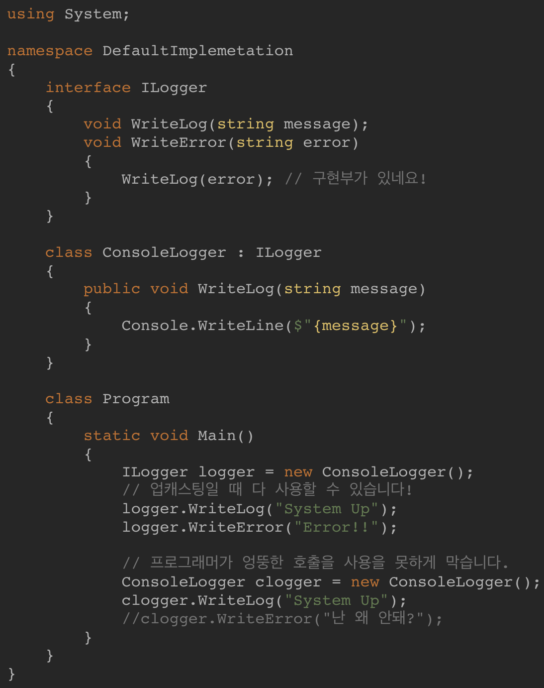
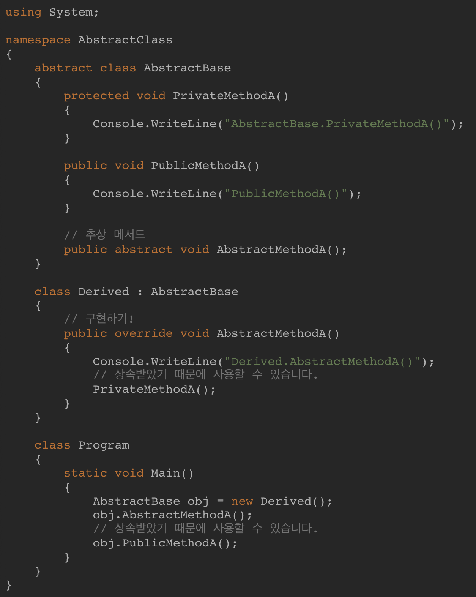

# Unity Question

## C# 
1. 인터페이스 와 가상, 추상 함수
    - Virtual(가상) : 하나의 기능을 하는 완전한 클래스, 파생 클래스에서 상속해서 추가적인 기능 추가 및 재정의 가능(**필수 아님**)
    - Abstract(추상) : 여러개의 파생 클래스에서 공유할 기본 클래스의 공텅적인 정의만 하고 파생 클래스에서는 **무조건 재정의를 해야함(필수)**
    - Interface : Abstract와 비슷하지만, 멤버 변수를 사용할 수 없음(interface는 instance를 만들수 없기 때문). 서로 다른 계층이나 타입이더라도 같은 기능을 추가하고 싶을 때 사용

2. 인터페이스 vs 추상 클래스
     - 인터페이스는 메서드, 이벤트, 인덱서, 프로퍼티만을 가질 수 있고 클래스의 선언과 비슷하지만 구현부가 없고 함수의 정의 부분만 존재
    - 인터페이스에서는 접근 제한 한정자를 사용할 수 없고 모든 것들이 public으로 선언
    - 클래스와는 다르게 인스턴스화를 만들 수가 없음
        - 다만 인터페이스를 상속한 클래스에서는 인스턴스를 만드는 것이 가능
    - 상속받은 클래스에서는 인터페이스에서 선언된 모든 메서드 및 프로퍼티를 구현해줘야 하고 이 메서드들을 public 한정자로 수식해야 함 

 
    
- 인터페이스를 사용하는 이유
    - 인터페이스는 하나의 약속으로 인터페이스를 가지고 있는 클래스들은 인터페이스에서 정의한 모든 것들을 구현해야 한다는 약속을 가지게 됨

- 인터페이스 기본 구현 메서드
인터페이스에서도 구현 메서드를 만들수 있는데 이는 인터페이스 참조로 업 캐스팅 했을 때만 사용할 수 있음. 그러므로 프로그래머가 파생 클래스에서 인터페이스에 추가된 메서드를 엉뚱하게 호출할 일이 없음

 

- 추상 클래스와 인터페이스 차이
    - 추상 클래스는 인터페이스와 클래스 사이
    - 추상 클래스는 인터페이스와 다르게 '구현'이 가능
        - 하지만 클래스와는 다르게 인스턴스화 및 인스턴스를 가질 수는 없음
        - 구현을 할 수 있지만 인스턴스를 만들지는 못함
    - 인터페이스는 모든 메서드가 public 이지만 클래스는 default가 private
    - 추상 클래스는 추상 메서드를 가질 수 있음
        추상 메서드는 구현을 못하지만 파생 클래스에서는 반드시 구현하도록 강제가 됨(인터페이스와 유사)

 

추상 클래스는 일반 클래스가 가질 수 있는 구현 + 추상 메서드를 가지고 있음 